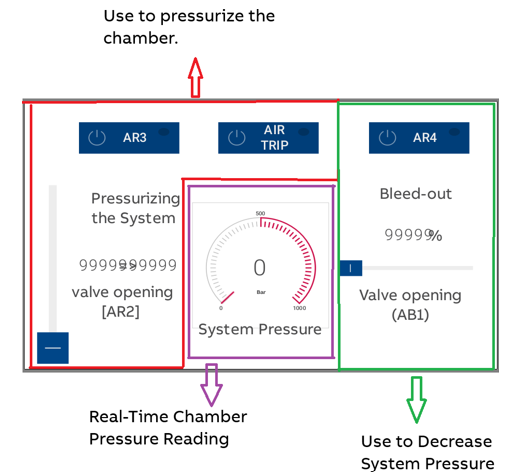

# Proserv Pump Control – ABB AC500 PLC

## Overview
This repository contains a PLC program written in **Structured Text (ST)** for the ABB AC500, designed to control the Proserv "50V" service pump.

The program includes:
- Valve control (AR2, AR3, AR4, AB1, Air Trip)
- Pressure monitoring via AI_AR2 (0–20 bar) and AI_PT (0–1000 bar)
- Basic HMI logic for manual operation and feedback

## Requirements
- ABB Automation Builder (tested with version 2.7 or newer)
- ABB AC500 PLC
- Control cabinet with HMI (e.g. CP604)
- Alternatively: ABB AC500-eCo V3 Starter Kit

